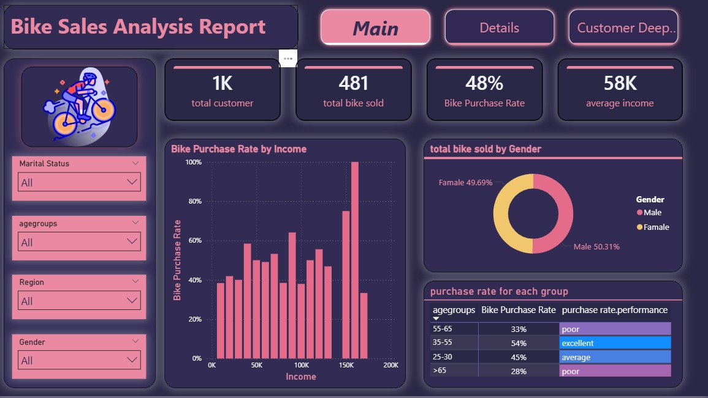
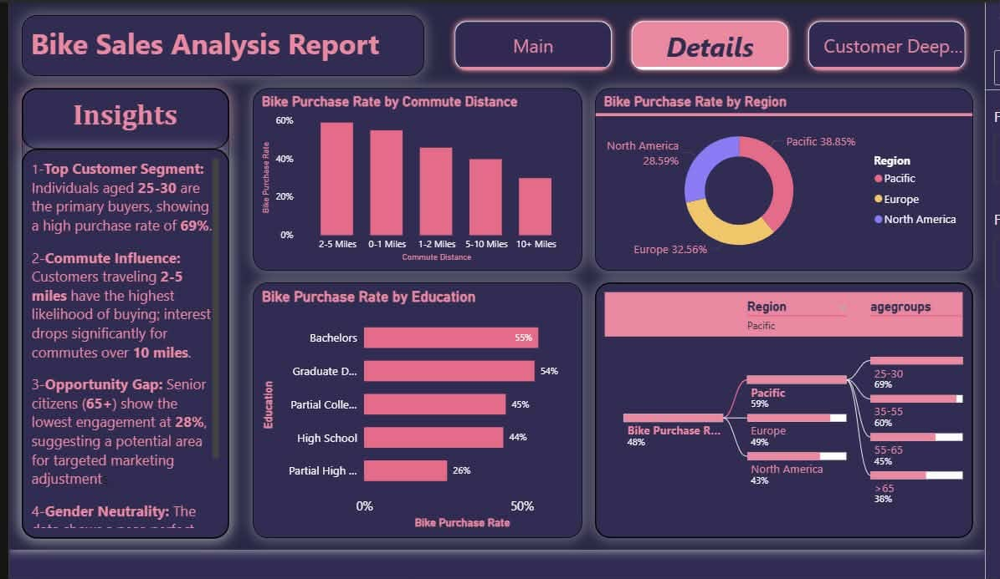
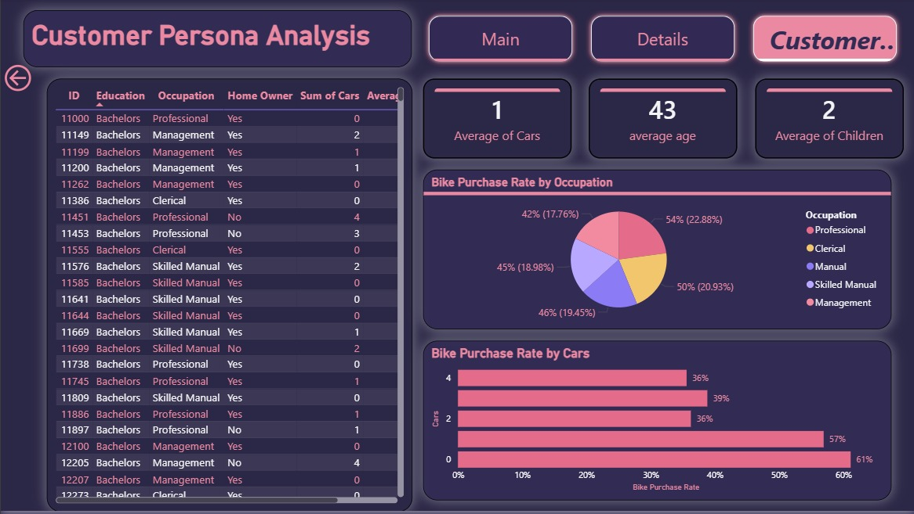

# 🚴 Bike Sales Analysis Dashboard

An interactive Microsoft Excel dashboard designed to analyze customer purchasing behavior, identify key sales drivers, and support business decision-making through data visualization and KPI tracking.

---

## 📌 Project Overview

This project analyzes customer demographic and behavioral data to understand the factors that influence bike purchasing decisions.

The dashboard provides interactive filtering and multiple analytical views, enabling stakeholders to explore customer segments, purchase patterns, and sales performance efficiently.

---

## 🎯 Business Objectives

- Identify the customer segments most likely to purchase bikes.
- Measure the overall bike purchase rate.
- Analyze demographic factors affecting purchasing decisions.
- Discover regional and behavioral trends.
- Build an interactive dashboard for business users.

---

## 📂 Dataset

The dataset contains customer information including:

- Customer ID
- Age
- Gender
- Marital Status
- Income
- Occupation
- Education
- Region
- Number of Cars
- Commute Distance
- Home Ownership
- Bike Purchase

---

## 🧹 Data Preparation

The dataset was prepared using Microsoft Excel.

Data preparation included:

- Removing duplicates
- Handling missing values
- Standardizing categories
- Creating calculated fields
- Building Pivot Tables
- Creating Pivot Charts

---

## 📊 Dashboard Pages

### 🏠 Main Dashboard

Displays high-level KPIs and overall purchase performance.

**Highlights**
- Total Customers
- Total Bikes Sold
- Purchase Rate
- Average Income

---

### 📈 Details Dashboard

Provides deeper business insights through customer segmentation.

Analysis includes:

- Purchase Rate by Region
- Purchase Rate by Education
- Purchase Rate by Commute Distance
- Key Business Insights

---

### 👥 Customer Persona Dashboard

Focuses on customer characteristics.

Includes:

- Occupation Analysis
- Cars Ownership Analysis
- Interactive Customer Table
- Average Age
- Average Number of Cars
- Average Number of Children

---

## 📈 Key KPIs

| KPI | Value |
|------|------:|
| Total Customers | 1,000 |
| Total Bikes Sold | 481 |
| Purchase Rate | 48% |
| Average Income | 58K |

---

## 💡 Key Insights

- Customers aged **25–30** achieved the highest purchase rate.
- The **Pacific** region recorded the strongest bike purchase performance.
- Customers with shorter commute distances are more likely to purchase bikes.
- Individuals holding Bachelor's or Graduate degrees demonstrate higher purchase rates.
- Purchase behavior is relatively balanced between male and female customers.

---

## 💼 Business Recommendations

- Prioritize marketing campaigns for customers aged **25–30**.
- Increase promotional efforts in high-performing regions.
- Design targeted offers for customers with short commuting distances.
- Develop campaigns tailored to highly educated customer segments.

---

## 🛠️ Tools & Skills

### Tools
- Microsoft Excel
- Pivot Tables
- Pivot Charts
- Slicers
- Conditional Formatting

### Skills
- Data Cleaning
- Data Analysis
- Business Intelligence
- Dashboard Design
- KPI Development
- Data Visualization
- Storytelling with Data

---

## 📸 Dashboard Preview

## 📸 Dashboard Preview

### 🏠 Main Dashboard

### 📈 Details Dashboard

### 👥 Customer Persona Dashboard

---

## 👨‍💻 Author

**Adham Attia**

Computer Science & AI Student

Data Analyst | Power BI | Excel | SQL | Python
